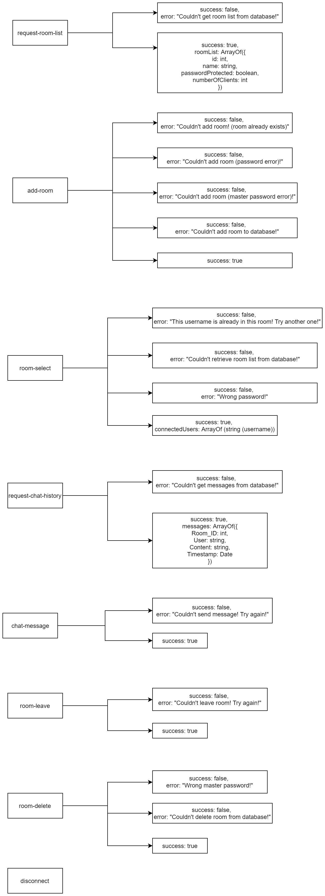

# Socket IO Chat client
======================
This is a simple chat client for Windows built for .NET 4.7 using WinForms and C#. Chat communication 
is done through socket.io, which is an open-source Javascript real-time messaging framework. 
Client is connected to a central server hosted on Azure Web Services, written in Node.js. 
Source code for the server can be found at the link below.
See also: [socket-io-chat-server](https://github.com/baso53/socket-io-chat-server)

Socket.io client library in C# that I'm using is available at the link below.
See also: [SocketIoClientDotNet](https://github.com/Quobject/SocketIoClientDotNet)

# Usage
Compile source code with target .NET framework 4.6.1 or download precompiled .exe from link below.
See also: [Releases](https://github.com/baso53/SocketIOChatClient/releases)

* Requirements
    * Windows 10 or .NET Framework 4.6.1

# Features
* Chat rooms (protected and unprotected)
* Creating chat rooms
* Deleting a chat room with master password set on creation of the room
* Real-time updating of connected users in the lobby and in rooms

# Implementation
Client API representation can be found below.

Squares on the left are the request strings that client sends, right 
is the response from the server in JSON (I didn't include the outer brackets of JSON).

# Special thanks
* BB
* Creator of C# Socket.io client
* socket.io for providing such an awesome framework